<!-- TÍTULO ANIMADO — arquivo typing-title.svg no repositório -->

  

  

---

## Sobre

Graduando em Análise e Desenvolvimento de Sistemas pela PUCPR e formado em Manutenção Eletroeletrônica pelo SENAI-SP.

Atuo no desenvolvimento de sistemas backend, pipelines de dados e automações inteligentes, com foco em Java e Python. Minha trajetória profissional no setor industrial consolidou uma base sólida em lógica estruturada, diagnóstico de falhas complexas e resiliência operacional. Traduzo essa bagagem de infraestrutura crítica na construção de softwares tolerantes a falhas, extração e limpeza de dados (ETL) e escrita de código limpo, sempre priorizando a integridade e a escalabilidade dos fluxos de informação. Atualmente, foco na integração de sistemas financeiros e análise estratégica de dados.

---

## Competências Técnicas

| Categoria | Tecnologias e Ferramentas |
|---|---|
| **Linguagens & IDEs** |      |
| **Backend & APIs** |    |
| **Dados & Análise** |     |
| **Bancos de Dados** |   |
| **Infraestrutura & Ferramentas** |    |

### Frentes de Atuação

**Engenharia de Software:** Domínio de Programação Orientada a Objetos em Java e Python, tratamento centralizado de exceções, estruturas de dados e código limpo.

**Engenharia de Dados:** Modelagem relacional, normalização de tabelas, escrita de queries complexas e consumo assíncrono de APIs RESTful com tratamento de payloads JSON/XML.

**Automação:** Scripts focados na otimização de processos de negócios, rotinas de ingestão e manipulação dinâmica de arquivos.

---

## ⭐ Projetos em Destaque

### ⚙️ [Omni Finance Engine](https://github.com/EnukNogueira/omni-finance-engine)
Um sistema financeiro construído em Java do zero, com regras de negócio reais para financiamento imobiliário — casa, apartamento e terreno, cada um com seu próprio cálculo via polimorfismo. Além do módulo de financiamento, integrei um painel de investimentos com cotações de ações em tempo real via API externa, conversão de JSON com Gson e projeção de patrimônio em renda fixa com juros compostos. A exceção customizada `ErrosExceptionFinanciamento` trava regras críticas de negócio na entrada de dados. Foi o projeto onde Orientação a Objetos deixou de ser conceito e virou arquitetura.

### 📦 [Ecommerce Data Pipeline](https://github.com/EnukNogueira/ecommerce-data)
Dados de clientes, comportamento de compra e evasão — tudo junto num único pipeline de análise. Trabalhei com consolidação de fontes separadas via merge, segmentação de risco com máscaras booleanas, agrupamentos multinível com groupby e criação de atributos classificatórios com `np.select()` — vetorizado, sem loops. Cada escolha técnica teve um motivo: entender não só quem estava saindo, mas por quê, e entregar isso de forma que um time de CRM pudesse usar.

### 📊 [Análise de Dados Steam](https://github.com/EnukNogueira/analise-steam)
Um dataset bruto de jogos da Steam, cheio de inconsistências e valores ausentes. Separei o processo em dois notebooks distintos: o primeiro dedicado à limpeza e engenharia de atributos, gerando um CSV curado como artefato reutilizável. O segundo, exclusivamente para análise — distribuição de preços, ranking de publishers e market share das grandes distribuidoras, com visualizações construídas em Matplotlib. Aprendi que pipeline de dados não é só código, é disciplina de processo.

### 🔋 [NASA Battery — Análise de Degradação](https://github.com/EnukNogueira/nasa-battery)
Dataset real do NASA Prognostics Center of Excellence (PCoE) — um benchmark usado em pesquisas de manutenção preditiva. Apliquei limpeza, padronização e análise exploratória sobre ciclos de carga e descarga de baterias Li-Ion 18650, mapeando a curva de degradação de capacidade ao longo do tempo. Próximo passo: modelagem preditiva de vida útil (RUL) com Machine Learning.

---

## Estatísticas e Atividades

  

<table width="100%">
  <tr>
    <td width="50%" align="center" valign="top">
      
    </td>
    <td width="50%" align="center" valign="top">
      
    </td>
  </tr>
  <tr>
    <td colspan="2" align="center" valign="top">
      
    </td>
  </tr>
</table>

---

## Contato Profissional

Atualmente aberto a novas oportunidades profissionais. Se a sua empresa busca um desenvolvedor com forte base analítica, focado na construção de arquiteturas backend e pipelines de dados estruturados, entre em contato diretamente pelo canal abaixo:

  

 

Obrigado por visitar.

