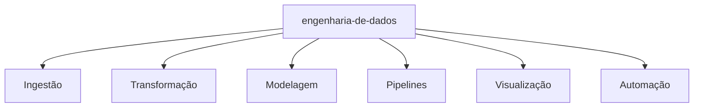

<!--   badges-topo -->
<p align="center">
    <a href="https://github.com/EnukNogueira/EnukNogueira"></a>
    <a href="https://github.com/python/cpython"></a>
    <a href="https://github.com/EnukNogueira/EnukNogueira/graphs/contributors"></a>
    <a href="https://github.com/EnukNogueira/EnukNogueira/stargazers"></a>
    <a href="https://github.com/EnukNogueira/EnukNogueira/network/members"></a>
    
</p>

<!--   typing-svg -->
[](https://git.io/typing-svg)

<a href="https://www.linkedin.com/in/enuknogueira/" target="blank">
  
</a>

---

<!--   skills-table -->
| Propriedade | Tecnologias |
|---|---|
| **Linguagens / IDE** |      |
| **Conhecimento de Domínio** | [](https://github.com/search?q=user%3AEnukNogueira&type=Repositories) [](https://github.com/search?q=user%3AEnukNogueira&type=Repositories) [](https://github.com/search?q=user%3AEnukNogueira&type=Repositories) [](https://github.com/search?q=user%3AEnukNogueira&type=Repositories) |
| **CI / CD** | [](https://github.com/EnukNogueira/EnukNogueira)    |
| **Dados & Análise** |     |
| **Banco de Dados** |   |
| **Backend & APIs** |    |
| **Cloud (Estudando)** |  |

---

<!--   activity-graph -->
### 📈 Gráfico de Atividade GitHub:

<!--   green snake -->


<!--   stats + languages -->
| . | . |
|---|---|
|  |  |

</img>

<!--   dark snake -->


<!--   3d contribution profile -->


---

**📫 Como me encontrar:**
<p align="left">
<a href="https://www.linkedin.com/in/enuknogueira/" target="blank"></a>
<a href="mailto:enuk.santos@gmail.com" target="blank"></a>
<a href="https://enuknogueira.github.io/" target="blank"></a>
</p>

---

<!--   trophy -->
<div align="center">
<summary>Trophy: Github Profile Trophy</summary>
</div>

<p align="center">
<a href="https://github.com/ryo-ma/github-profile-trophy"></a>
</p>

---

<!--   mermaid-diagram -->


---

<!--   github-metrics -->


---

<!-- Brasil - Minha Casa -->
```geojson
{
  "type": "FeatureCollection",
  "features": [
    {
      "type": "Feature",
      "id": 1,
      "properties": {
        "ID": 0
      },
      "geometry": {
        "type": "Polygon",
        "coordinates": [
          [
            [-73.9, 5.3],
            [-34.8, 5.3],
            [-34.8, -33.7],
            [-73.9, -33.7],
            [-73.9, 5.3]
          ]
        ]
      }
    }
  ]
}
```

---

#### Obrigado por visitar :heart:

<p align="center">


contagem de visitantes iniciada em 2025


</br>

[MIT](LICENSE)

</p>

---
*Se gostou do meu perfil, pode dar uma Star ⭐ no repositório e, se quiser usar este template, pode fazer um Fork e adaptar.*

---


